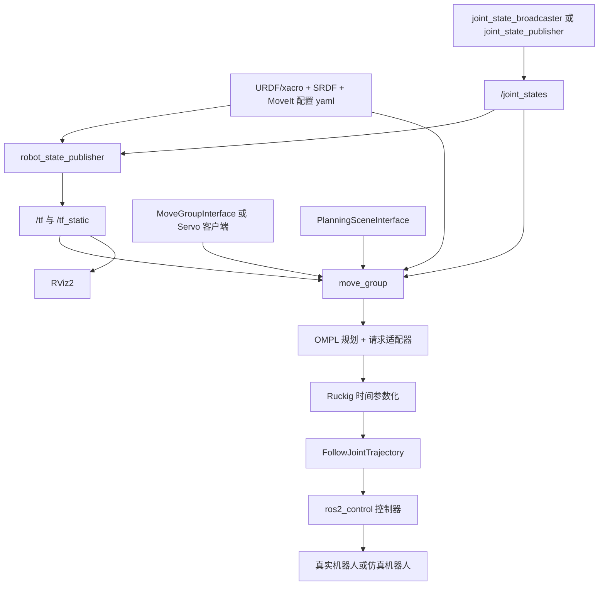

### MoveIt 一体化笔记（融合版）

> 目标：把分散笔记融成一条可执行工程链路，覆盖建模、状态、规划、执行、调试与代码封装。排版风格对齐 `Use git.md`。

------

#### 阅读方式

1.  先看“全链路总览”，建立系统图。
2.  再按“模型 → 状态 → 场景 → 规划 → 执行”逐段落地。
3.  最后按“排错清单”逐项对照工程。

------

#### 全链路总览（先记住这 1 张图）



**系统定义**：
MoveIt 系统由“模型 + 当前状态 + 环境碰撞 + 规划算法 + 控制执行”组成；链路中任一环节配置不一致，都可能触发规划失败或执行异常。

------

#### 1. 机器人模型层（URDF + SRDF）

`URDF` 决定“机器人长什么样、怎么动”；`SRDF` 决定“这些结构在规划里怎么被使用”。

##### URDF 负责什么

-   描述 `link/joint` 树。
-   给出关节类型、轴向、上下限。
-   提供 `visual/collision` 模型。
-   提供惯性参数（动力学和仿真相关）。
-   提供传感器/工具挂载坐标（有则更完整）。

##### SRDF 负责什么

-   规划组（Planning Groups）。
-   末端执行器（End Effectors）。
-   虚拟关节（机器人与 world 的关系）。
-   自碰撞矩阵（忽略不必要碰撞对）。
-   默认姿态（home/ready 等）。

##### 常见工程原则

-   URDF 与真实硬件关节方向必须一致。
-   URDF 的关节命名必须与控制器 joint 列表一致。
-   SRDF 的 group 必须和代码里 `PLANNING_GROUP` 一致。
-   可视化模型可精细，碰撞模型应尽量简化。

##### 快速检查命令

```bash
check_urdf robot.urdf
ros2 run tf2_tools view_frames
ros2 topic echo /joint_states
```

------

#### 2. 状态链路层（/joint_states 与 /tf）

这是 MoveIt 最容易被忽略、但最关键的链路。

##### 核心事实

-   `move_group` 需要 `/joint_states` 才能知道“当前起点”。
-   `RViz2` 主要看 `/tf`，不是直接看 `/joint_states`。
-   `robot_state_publisher` 用“URDF + /joint_states”计算并发布 `/tf`。

##### joint_state_publisher 与 joint_state_broadcaster 区别

`joint_state_broadcaster`：

-   属于 `ros2_control` 控制器体系。
-   从硬件状态接口读取真实关节状态。
-   适合真机或带硬件接口仿真。

`joint_state_publisher`：

-   独立节点（可 GUI）。
-   手动生成关节状态。
-   适合无硬件时验证 URDF/TF。

##### 链路事实

-   真实控制链路优先用 `joint_state_broadcaster`。
-   演示/建模阶段可用 `joint_state_publisher_gui`。
-   不能同时让多个来源“抢着发布”同一机器人状态。

##### 异常现象速判

-   RViz 机器人“散架/堆原点”：多半是 TF 链路问题。
-   MoveIt 提示起点无效：多半是 `/joint_states` 没进来或时间不同步。

------

#### 3. 时间基准层（use_sim_time）

> 原 `use_sim_time.md` 是 WPS 二进制文件，无法直接提取正文；这里融合补充工程上必须掌握的时间同步要点。

##### 核心原则

-   仿真时：所有相关节点统一 `use_sim_time:=true`。
-   真机时：一般使用系统时钟，不要混用仿真时钟。
-   一套系统内禁止“部分节点仿真时钟、部分节点系统时钟”。

##### 为什么重要

MoveIt、TF、控制器都依赖时间戳；时间基准不一致会导致：

-   TF extrapolation 报错。
-   轨迹过期或还未生效。
-   状态监视器（CurrentStateMonitor）拿不到“有效当前状态”。

##### 检查命令

```bash
ros2 param get /move_group use_sim_time
ros2 param get /robot_state_publisher use_sim_time
ros2 topic echo /clock
```

------

#### 4. move_group 与 MoveGroupInterface（规划中枢）

##### 角色分工

-   `move_group`：服务端/中枢，维护模型、场景、规划插件、执行接口。
-   `MoveGroupInterface`：客户端高层封装，提供目标设置、规划、执行 API。

##### MoveGroupInterface 常用动作

-   设置目标：关节目标、位姿目标、路径约束。
-   发起规划：`plan()`。
-   执行轨迹：`execute()` 或 `move()`。
-   查询状态：当前关节、当前位姿。

##### 内部关键对象

-   `RobotModel`：静态模型（结构/约束/分组）。
-   `RobotState`：动态状态（当前关节值等）。
-   `CurrentStateMonitor`：通过 `/joint_states` 持续更新 `RobotState`。
-   `JointModelGroup`：某个规划组对应的关节集合。

##### 高频坑位

-   在构造函数里直接 `shared_from_this()` 初始化 MoveGroupInterface 可能导致生命周期问题。
-   group 名称写错，导致“找不到 JointModelGroup”。
-   目标姿态参考坐标系不明确，导致姿态看似正确但规划失败。

------

#### 5. PlanningScene（环境与碰撞）

`PlanningScene` 是“机器人状态 + 环境物体 + 碰撞逻辑”的统一容器。

##### PlanningSceneInterface 常见操作

-   添加障碍物（`CollisionObject`）。
-   移除障碍物。
-   查询已知对象（如 `getKnownObjectNames()`）。
-   设置附着物体（抓取时把物体挂到末端）。

##### 实践要点

-   障碍物坐标必须在统一参考系下（通常 `base_link` 或 `world`）。
-   避免把障碍物放到机械臂初始姿态内，导致“起点即碰撞”。
-   抓取后要把物体从“世界对象”切换为“附着对象”。

##### 最小示例（概念）

```cpp
std::vector<std::string> names = planning_scene_interface.getKnownObjectNames();
if (std::find(names.begin(), names.end(), "silver_box") == names.end()) {
  // 构造 CollisionObject 并 apply
}
```

------

#### 6. 规划与轨迹后处理（OMPL + RequestAdapters + Ruckig）

##### 规划主干

-   MoveIt 常用 OMPL（如 `RRTConnect`）生成几何路径。
-   生成几何路径后，还要做时间参数化，才能给控制器执行。

##### 请求适配器（典型顺序）

1.  `FixWorkspaceBounds`
2.  `FixStartStateBounds`
3.  `FixStartStateCollision`
4.  `FixStartStatePathConstraints`
5.  `AddRuckigTrajectorySmoothing`

##### Ruckig 的作用

-   在关节速度/加速度限制下生成更平滑、时间可执行轨迹。
-   替代旧式时间参数化后处理时，通常有更平滑的速度曲线。

##### 配置要点

-   `ompl_planning.yaml` 中启用 `AddRuckigTrajectorySmoothing`。
-   `joint_limits.yaml` 必须给出合理速度/加速度上限。
-   关节限制要与真实驱动能力一致，避免“可规划不可执行”。

------

#### 7. 执行链路（MoveIt 到 ros2_control）

##### 执行路径

1.  客户端（MoveGroupInterface/Servo）发请求到 `move_group`。
2.  `move_group` 生成并后处理轨迹。
3.  轨迹通过 `FollowJointTrajectory` action 下发。
4.  `joint_trajectory_controller` 执行。
5.  `joint_state_broadcaster` 回传实时状态，形成闭环。

##### 对接一致性清单

-   控制器 joint 顺序与 MoveIt group 顺序一致。
-   controller 名称、action namespace 与 MoveIt 配置一致。
-   关节单位（弧度/米）保持一致。
-   初始姿态要在关节限制内且非碰撞。

------

#### 8. Servo 节点链路（增量控制）

该链路的目标是将 Servo 规划结果按时间戳输出为控制消息。

##### Servo 常见输入类型

-   `JointJog`：直接给关节增量。
-   `Twist`：给末端线速度/角速度。
-   `Pose`：给目标姿态（通常经转换后执行）。

##### 实现约束

-   明确输入帧（base/tool/world）。
-   做速度、加速度、关节限幅保护。
-   下游消息头时间戳统一时钟源。
-   若输出自定义消息（如 `joints.msg`），要保留可追踪的帧 id 与时间戳。

------

#### 9. 代码封装规范（MoveGroupInterface 封装成类）

以下结构用于降低时序相关初始化风险并提升可维护性。

##### 结构要求

-   节点类只保留“生命周期 + 参数 + 回调”。
-   MoveIt 接口对象延迟初始化（避免构造期时序问题）。
-   规划组、参考系、容差放参数服务器，避免硬编码。

##### 示意代码（关键点）

```cpp
class EngineerArmInterface : public rclcpp::Node {
public:
  explicit EngineerArmInterface(const rclcpp::NodeOptions& options = rclcpp::NodeOptions())
  : Node("engineer_arm_interface", options) {
    planning_group_ = this->declare_parameter<std::string>("planning_group", "clb_arm");
    initMoveIt();
  }

private:
  void initMoveIt() {
    move_group_ = std::make_unique<moveit::planning_interface::MoveGroupInterface>(
      shared_from_this(), planning_group_);
    joint_model_group_ = move_group_->getCurrentState()->getJointModelGroup(planning_group_);
  }

  std::string planning_group_;
  std::unique_ptr<moveit::planning_interface::MoveGroupInterface> move_group_;
  const moveit::core::JointModelGroup* joint_model_group_{nullptr};
};
```

##### 稳定性原因

-   规避对象构造顺序带来的空指针/未初始化问题。
-   后续加多规划组、多末端时可扩展。
-   与参数化 launch 更好配合。

------

#### 10. 标准启动顺序（模板）

1.  启动机器人描述与状态链路：`robot_state_publisher` + joint states 来源。
2.  验证 `/joint_states` 与 `/tf` 正常。
3.  启动 `move_group` 与 RViz。
4.  添加 PlanningScene 障碍物并验证。
5.  启动客户端（MoveGroupInterface 或 Servo）。
6.  先做小范围规划，再开启全流程执行。

------

#### 11. 排错清单（按优先级）

##### A. 一上来就失败（最高优先）

-   `/joint_states` 没有持续发布。
-   `use_sim_time` 不一致。
-   规划组名字与 SRDF 不一致。

##### B. 能规划不能执行

-   控制器 action 名称不匹配。
-   joint 顺序不一致。
-   轨迹时间参数化异常或限制过严。

##### C. 执行抖动/不平滑

-   `joint_limits.yaml` 过激进。
-   未启用 Ruckig 平滑。
-   低层控制周期与轨迹采样不匹配。

##### D. RViz 显示异常

-   TF 断链或参考系错。
-   模型坐标系定义反向。
-   末端工具坐标与法兰坐标混淆。

------

#### 12. 常用配置片段（便于复制）

启用 Ruckig 的 `ompl_planning.yaml` 片段：

```yaml
ompl:
  request_adapters: >-
    default_planner_request_adapters/FixWorkspaceBounds
    default_planner_request_adapters/FixStartStateBounds
    default_planner_request_adapters/FixStartStateCollision
    default_planner_request_adapters/FixStartStatePathConstraints
    default_planner_request_adapters/AddRuckigTrajectorySmoothing
```

`ros2_control` 里发布 joint states：

```yaml
joint_state_broadcaster:
  type: joint_state_broadcaster/JointStateBroadcaster
```

------

#### 13. 接口与话题清单（核对用）

`move_group` 订阅/依赖：

-   `/joint_states`（当前状态）
-   `/tf` 与 `/tf_static`（坐标变换）
-   机器人描述参数（URDF/SRDF）
-   规划配置（`ompl_planning.yaml`、`kinematics.yaml`、`joint_limits.yaml`）

常见交互接口：

-   `MoveGroupInterface` -> `move_group`（规划与执行请求）
-   `move_group` -> `FollowJointTrajectory`（控制器执行）
-   `PlanningSceneInterface` -> 规划场景（障碍物增删改查）

状态与可视化：

-   `robot_state_publisher`：`/joint_states` -> `/tf`
-   `RViz2`：消费 `/tf`、规划结果与场景对象

------

#### 14. 参数基线（起步值，需按设备修订）

`joint_limits.yaml`（每个关节）：

-   `has_velocity_limits: true`
-   `max_velocity: 0.5 ~ 1.5`（rad/s，按减速比与负载修订）
-   `has_acceleration_limits: true`
-   `max_acceleration: 0.5 ~ 2.0`（rad/s^2）

规划参数（示例基线）：

-   `planning_time: 3.0 ~ 8.0`（s）
-   `num_planning_attempts: 3 ~ 10`
-   `goal_position_tolerance: 1e-3 ~ 1e-2`（m）
-   `goal_orientation_tolerance: 1e-3 ~ 1e-2`（rad）

控制器周期参考范围：

-   轨迹控制周期：`100Hz ~ 500Hz`
-   状态发布频率：`30Hz ~ 250Hz`
-   Servo 输入频率：`50Hz ~ 400Hz`

------

#### 15. 验收标准（客观判定）

启动后 30 秒内满足以下条件可判定“链路可用”：

1.  `/joint_states` 连续发布，频率稳定，无长时间断流。
2.  `view_frames` 生成的 TF 树完整，末端链路无断点。
3.  MoveIt 可完成一次关节目标规划并执行，无碰撞/越界报错。
4.  加入 1 个障碍物后，规划轨迹可观察到避障行为。
5.  执行后实测关节终点误差在容差阈值内。

回归测试最低集合：

1.  默认位姿 -> 目标位姿 -> 默认位姿 往返 10 次。
2.  负载变化（空载/额定负载）各执行 5 次。
3.  打开/关闭 Ruckig 各执行 3 次并记录峰值速度差异。

------

#### 16. 常见日志与处置对照

`Failed to fetch current robot state`：

-   常见原因：`/joint_states` 未发布、时钟不一致、命名空间错误。
-   处置：检查 topic 实际名称与 remap，核对 `use_sim_time`。

`No kinematic solver instantiated for group`：

-   常见原因：`kinematics.yaml` 未配置该 group，或 group 名拼写错误。
-   处置：核对 SRDF group 名与 `kinematics.yaml` 键名一致性。

`Unable to sample any valid states for goal tree`：

-   常见原因：目标不可达、起点/目标碰撞、约束过严。
-   处置：放宽容差，清空路径约束，验证目标是否在可达工作空间。

`TF_OLD_DATA` / `Lookup would require extrapolation`：

-   常见原因：时钟源混用、TF 时间戳过旧、系统延迟过大。
-   处置：统一时钟源，检查 `/clock` 与节点 `use_sim_time`。

`Controller is not running` / `Action server not available`：

-   常见原因：控制器未激活或 action 名称不匹配。
-   处置：检查 controller_manager 状态与 MoveIt 控制器配置。

------

#### 17. 结论（工程视角）

-   MoveIt 成败不在单一算法，而在“全链路一致性”。
-   模型一致、时间一致、坐标一致、关节顺序一致，系统就稳定。
-   先保证状态与场景正确，再追求规划速度和轨迹美观。
